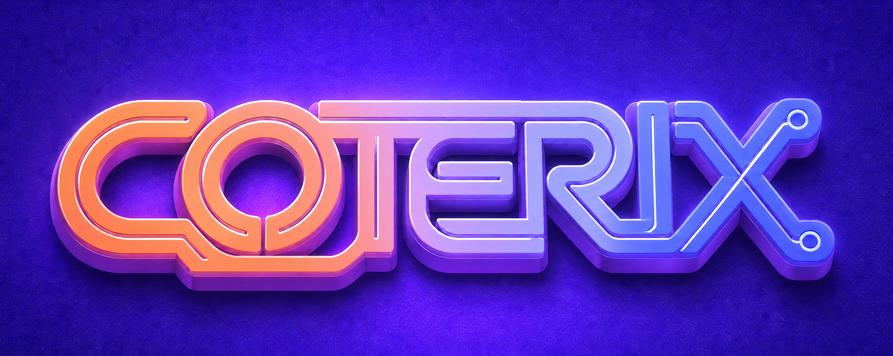

# Coterix

> Claude와 Codex가 계획, 구현, 리뷰를 교차 수행하도록 조율하는 헤드리스 오케스트레이터.

**현재 상태:** `0.0.2` · 개발 중

## Coterix란

Coterix는 모델 API를 직접 호출하는 에이전트가 아니라, `claude -p`와
`codex exec`를 각각 fresh subprocess로 실행하는 헤드리스 B-모델
오케스트레이터입니다. 계획과 구현의 작성자·리뷰어를 서로 다른 모델에
배정해 한 모델의 결과를 다른 모델이 검토하고, 파일·프로세스 종료 코드·Git
상태를 파이프라인의 공식 근거로 사용합니다.

파이프라인은 다음 순서로 진행됩니다.

1. **계획 작성 — Claude CLI:** `plan_writer`가 요청을 `plan.md`로 작성합니다.
2. **구조 검증 — Coterix:** 내장된 결정론적 validator가 계획의 필수 구조를
   검사합니다. 이 단계는 모델 CLI에 맡기지 않습니다.
3. **계획 리뷰 핑퐁 — Codex CLI ↔ Claude CLI:** `plan_reviewer`가 계획을
   검토하고, 수정이 필요하면 `plan_reviser`가 반영합니다. 구조 검증과 리뷰를
   통과할 때까지 제한된 횟수 안에서 반복합니다.
4. **계획 확정 — 사람:** 사람이 검증된 계획을 승인합니다. **정상 경로의
   사람 게이트는 계획 확정 하나뿐입니다.**
5. **구현과 리뷰 루프 — Codex CLI ↔ Claude CLI:** `impl_writer`가 승인된
   태스크를 구현하고 `impl_reviewer`가 검토합니다. 수정이 필요하면
   `impl_writer`와 동일한 Codex CLI 설정을 사용하는 `fixer`가 보완한 뒤
   검증과 리뷰를 다시 실행합니다.
