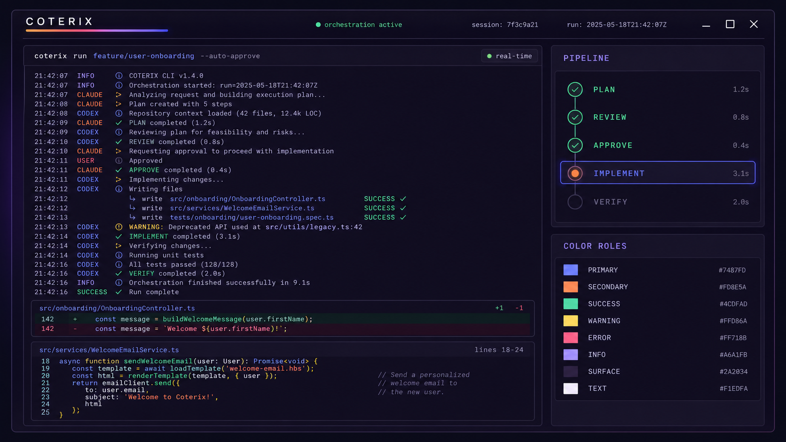

# COTERIX color system

COTERIX의 컬러 시스템은 선택된 로고 [`assets/coterix.png`](../assets/coterix.png)의
Claude 오렌지 → Codex 블루 흐름을 브랜드 축으로 사용한다. 구조는 Crush의
`quickStyleOpts`와 ANSI 16색 재매핑 방식을 참고하되, 색상 자체는 COTERIX 전용으로
다시 설계했다.

실제 구현 토큰의 단일 원본은
[`design/coterix-color-tokens.json`](../design/coterix-color-tokens.json)이다.



## 조사 기준

- Crush 저장소: `charmbracelet/crush`
- 조사 커밋: `e4175c52b8e14a4e158106ac5988fd42a8958457`
- 기본 테마: `CharmtonePantera()`
- CharmTone 고정 버전: `v0.0.0-20260527151214-009e6338d40d`
- 핵심 소스:
  - `internal/ui/styles/themes.go`
  - `internal/ui/styles/quickstyle.go`
  - `internal/ui/styles/grad.go`
  - `internal/ui/diffview/style.go`
  - `internal/cmd/stats/index.css`

## Crush 컬러 구조 조사

Crush의 기본 테마 생성자는 총 42개의 입력 슬롯을 받는다.

- 브랜드·전경·배경·상태: 26개
- ANSI 16색: 16개

### 브랜드, 표면, 상태 26개

| 역할 | Crush 이름 | Crush HEX | COTERIX |
|---|---:|---:|---:|
| `primary` | Charple | `#6B50FF` | `#7487FD` |
| `secondary` | Dolly | `#FF60FF` | `#FD8E5A` |
| `accent` | Bok | `#68FFD6` | `#A6A1FB` |
| `keyword` | Blush | `#FF84FF` | `#D9A3EB` |
| `fgBase` | Sash | `#ECEBF0` | `#F1EDFA` |
| `fgSubtle` | Smoke | `#BFBCC8` | `#C0B8CA` |
| `fgMoreSubtle` | Squid | `#858392` | `#A098AA` |
| `fgMostSubtle` | Oyster | `#605F6B` | `#7E7689` |
| `onPrimary` | Butter | `#FFFAF1` | `#160F1D` |
| `bgBase` | Pepper | `#201F26` | `#160F1D` |
| `bgLeastVisible` | BBQ | `#2D2C36` | `#1E1628` |
| `bgLessVisible` | Char | `#3A3943` | `#2A2034` |
| `bgMostVisible` | Iron | `#4D4C57` | `#3A2E46` |
| `separator` | Char | `#3A3943` | `#493A58` |
| `destructive` | Coral | `#FF577D` | `#FF5D75` |
| `error` | Sriracha | `#EB4268` | `#E33C5C` |
| `warning` | Mustard | `#F5EF34` | `#FFC857` |
| `warningSubtle` | Zest | `#E8FE96` | `#FFD86A` |
| `denied` | Tang | `#FF985A` | `#FD8E5A` |
| `busy` | Citron | `#E8FF27` | `#D9A3EB` |
| `info` | Malibu | `#00A4FF` | `#7487FD` |
| `infoMoreSubtle` | Sardine | `#4FBEFE` | `#A6A1FB` |
| `infoMostSubtle` | Damson | `#007AB8` | `#4B56E6` |
| `success` | Julep | `#00FFB2` | `#4CDFAD` |
| `successMoreSubtle` | Bok | `#68FFD6` | `#78EBC3` |
| `successMostSubtle` | Guac | `#12C78F` | `#1BA77A` |

`onPrimary`는 로고의 밝은 블루와 오렌지 위에서 충분한 대비를 확보하기 위해
밝은색이 아니라 잉크색을 사용한다.

### ANSI 16색

Crush는 셸 명령 출력이 사용자의 터미널 팔레트에 따라 무너지지 않도록 ANSI
0–15를 테마 안에서 다시 매핑한다. COTERIX도 같은 전략을 사용한다.

| ANSI | Crush | Crush HEX | COTERIX |
|---|---|---:|---:|
| black | BBQ | `#2D2C36` | `#1E1628` |
| red | Coral | `#FF577D` | `#E33C5C` |
| green | Guac | `#12C78F` | `#1BA77A` |
| yellow | Mustard | `#F5EF34` | `#C7862D` |
| blue | Charple | `#6B50FF` | `#4B56E6` |
| magenta | Dolly | `#FF60FF` | `#A83EBD` |
| cyan | Malibu | `#00A4FF` | `#159BB4` |
| white | Smoke | `#BFBCC8` | `#C0B8CA` |
| bright black | Iron | `#4D4C57` | `#493A58` |
| bright red | Tuna | `#FF6DAA` | `#FF718B` |
| bright green | Julep | `#00FFB2` | `#4CDFAD` |
| bright yellow | Zest | `#E8FE96` | `#FFD86A` |
| bright blue | Guppy | `#7272FF` | `#8892FF` |
| bright magenta | Blush | `#FF84FF` | `#D9A3EB` |
| bright cyan | Sardine | `#4FBEFE` | `#6FE6F5` |
| bright white | Salt | `#F7F6FB` | `#FAF8FF` |

### Crush가 추가로 참조하는 CharmTone 색상

테마 입력 외에도 마크다운 Chroma 문법 강조, 프롬프트 오버라이드, 로고와
상태 표현에서 다음 색을 직접 참조한다.

| 이름 | HEX | 대표 사용 |
|---|---:|---|
| Anchovy | `#719AFC` | 블루 보조색 |
| Bengal | `#FF6E63` | 전처리기 |
| Cheeky | `#FF79D0` | 이미지·builtin |
| Cherry | `#FF388B` | 삭제·브랜드 보조 |
| Cumin | `#BF976F` | 문자열 |
| Hazy | `#8B75FF` | bang 프롬프트·attribute |
| Larple | `#7B62FF` | bang blurred |
| Mauve | `#D46EFF` | 태그 |
| Ox | `#3331B2` | 블루 음영 |
| Pony | `#FF4FBF` | reserved·namespace |
| Salmon | `#FF7F90` | 연산자 |
| Sapphire | `#4949FF` | 블루 |
| Thunder | `#4776FF` | 블루 |
| Turtle | `#0ADCD9` | 시안 |
| Zinc | `#10B1AE` | 링크 |

Crush 전체 소스에서 참조된 CharmTone 고유 이름은 42개다. 위 세 표에는 테마
입력과 추가 참조를 역할 중심으로 정리했으며, 중복 참조는 한 번만 설명했다.

### 직접 하드코딩된 색상

CharmTone 외에 18개의 고유 HEX가 화면별로 직접 지정되어 있다.

| 범위 | 색상 |
|---|---|
| 다크 diff 추가 | `#629657`, `#2B322A`, `#323931` |
| 다크 diff 삭제 | `#A45C59`, `#312929`, `#383030` |
| diffview 다크 배경 | `#293229`, `#303A30`, `#332929`, `#3A3030` |
| diffview 라이트 추가 | `#C8E6C9`, `#E8F5E9` |
| diffview 라이트 삭제 | `#FFCDD2`, `#FFEBEE` |
| stats 라이트 배경 | `#F0F0F0` |
| stats 보정 Charple | `#644CED` |
| stats heart accent | `#FF13A9` |
| stats secondary bg | `#2D2C35` |

`logout.go`에는 추가로 xterm 인덱스 `205`, `252`, `215`가 남아 있다. 이는 각각
핑크, 밝은 회색, 오렌지 계열의 레거시 스타일이다.

## COTERIX 브랜드 기준점

로고 픽셀을 24색으로 양자화해 얻은 대표 기준색을 토큰에 반영했다.

| 역할 | HEX | 출처 |
|---|---:|---|
| Claude neon | `#FD8E5A` | 왼쪽 워드마크 |
| Claude soft | `#F79E9D` | 중앙 전환부 |
| bridge lavender | `#D9A3EB` | 중앙 전환부 |
| Codex lavender | `#A6A1FB` | 오른쪽 워드마크 |
| Codex blue | `#5E67FA` | 오른쪽 워드마크 |
| ambient violet | `#5B24E2` | 배경 발광 |
| ambient deep | `#2D0FAD` | 배경 주조색 |
| ambient shadow | `#1A086E` | 배경·입체 음영 |

기본 브랜드 그라디언트:

```text
#FD8E5A → #F79E9D → #D9A3EB → #A6A1FB → #5E67FA
```

반대 방향도 토큰에 포함하지만, 현재 선택된 로고와 CLI의 기본 방향은
Claude 오렌지 → Codex 블루다.

## 색상 범위

각 램프는 `50`이 가장 밝고 `950`이 가장 어둡다.

| 램프 | 핵심 범위 | 사용 |
|---|---|---|
| `ink` | `#FAF8FF`–`#160F1D` | 텍스트, 표면, 경계 |
| `codex` | `#F4F4FF`–`#1A1D52` | primary, info, focus |
| `claude` | `#FFF5F1`–`#3E1914` | secondary, cursor, denied |
| `violet` | `#F7F2FF`–`#1A086E` | bridge, ambient, busy |
| `success` | `#EDFFF8`–`#073023` | 완료, 추가 diff |
| `warning` | `#FFFBEB`–`#3D210D` | 경고, 승인 대기 |
| `danger` | `#FFF1F4`–`#490F1E` | 오류, 삭제 diff |
| `cyan` | `#ECFCFF`–`#0A303B` | 링크, 숫자, 보조 정보 |

## CLI 적용 규칙

### 브랜드 색

- `primary` 블루는 선택, 포커스, 현재 단계, info에 사용한다.
- `secondary` 오렌지는 커서, 사용자/Claude 역할, 주의가 필요한 결정에 사용한다.
- 두 색을 동시에 채우는 것은 로고, working indicator, 큰 섹션 타이틀로 제한한다.
- 본문 전체를 그라디언트로 칠하지 않는다.

### 표면

- 기본 캔버스는 `#160F1D`.
- 패널은 `#1E1628`, 코드 블록은 `#2A2034`, 선택·포커스 표면은 `#3A2E46`.
- 경계선은 `#493A58`; 비활성 요소에 브랜드색을 쓰지 않는다.

### 상태

- 성공 `#4CDFAD`, 경고 `#FFD86A`, 오류 `#FF718B`는 브랜드색과 구분한다.
- 정보 상태만 Codex 블루 계열을 공유한다.
- Claude 오렌지는 일반 경고가 아니라 `denied`, 사용자 결정, 커서에 사용한다.
- 상태는 색상과 함께 `✓`, `!`, `×`, `i`, `⋯` 아이콘을 항상 병행한다.

### Diff

- 추가: `#142C27` 배경 + `#78EBC3` 텍스트.
- 삭제: `#321722` 배경 + `#FF9CAF` 텍스트.
- 한 줄 강조에서만 더 진한 `emphasisBg`를 사용한다.

### 접근성

- 밝은 브랜드 배경 위 텍스트는 `onPrimary=#160F1D`.
- `fgMostSubtle=#7E7689`는 장식·비활성 정보 전용이며 본문에 사용하지 않는다.
- 본문은 `fgBase` 또는 `fgSubtle`, 보조 설명은 `fgMoreSubtle`을 사용한다.
- 색만으로 상태를 전달하지 않는다.

## 권장 Go/Lipgloss 매핑

Go 테마 구현 시 JSON의 `theme` 객체를 Crush의 `quickStyleOpts`와 같은 필드에
일대일로 주입한다. ANSI 출력에는 `ansi` 객체를 0–15 순서로 사용하고,
마크다운 Chroma에는 `syntax`, diff 렌더러에는 `diff` 객체를 사용한다.

이 구조를 따르면 색상 변경이 컴포넌트별 하드코딩으로 번지지 않고, 향후
라이트 테마를 추가할 때도 원색 램프는 유지한 채 시맨틱 매핑만 교체할 수 있다.
